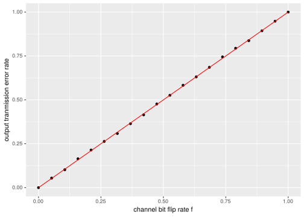
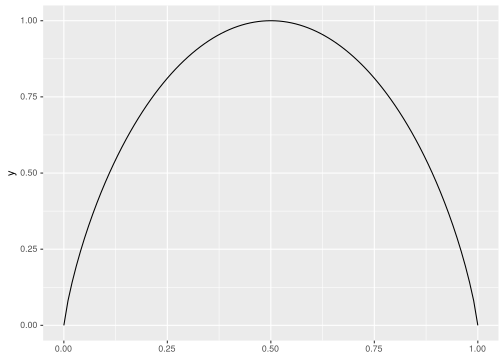
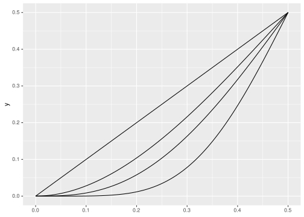
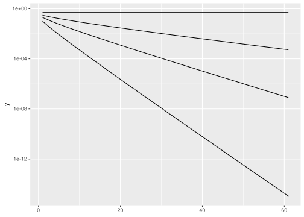

Chapter 1 – Introduction to Information Theory
================
Daniel de Bortoli & Gavin Leech
Feb 2021

-   [Encoding / decoding](#encoding--decoding)
-   [Repetition codes](#repetition-codes)
-   [Hamming codes](#hamming-codes)

## Encoding / decoding

We’ll be transmitting over binary symmetric channels. First a sanity
check to see if implementation is okay

``` r
# Since the error probabilities are symmetric, the input string doesn't really matter

fs <- seq(0.0, 1.0, length.out = 20)
message <- random_bit_stream(1e4)

errors <- fs %>%
  map_dbl(~message %>%
            transmit(.x) %>%
            error_rate(message)
)

tibble(fs, errors) %>%
  ggplot(aes(fs, errors)) +
  geom_point() +
  geom_function(fun = ~.x, colour = "red") +
  labs(x = "channel bit flip rate f",
       y = "output tranmission error rate")
```

<!-- -->

# Repetition codes

``` r
# Since the error probabilities are symmetric, the input string doesn't really matter
n_cores <- max(1, parallelly::availableCores() / 2)
future::plan(strategy = "multisession",
             workers = n_cores)

Ns <- seq(1, 41, by = 2)
f <- 0.25
message <- random_bit_stream(5e4)

errors <- Ns %>%
  future_map_dbl(~message %>%
                   rep_code_encode(.x) %>%
                   transmit(f) %>%
                   rep_code_decode(.x) %>%
                   error_rate(message),
                   .options = furrr_options(seed = TRUE)
)

tibble(rates = 1/Ns, errors) %>%
  ggplot(aes(rates, errors)) +
  geom_point() +
  scale_y_log10()
```

<!-- -->

``` r
ggplot() +
  xlim(0, 1) +
  geom_function(fun = H2)
```

<!-- -->

``` r
ggplot() +
  xlim(0, 0.5) +
  geom_function(fun = rep_code_error_proba, args = list(N = 1)) +
  geom_function(fun = rep_code_error_proba, args = list(N = 3)) +
  geom_function(fun = rep_code_error_proba, args = list(N = 5)) +
  geom_function(fun = rep_code_error_proba, args = list(N = 11))
```

<!-- -->

As expected, at error probability of 0.5, it’s a coin-flip and no amount
of repetition helps:

``` r
ggplot() +
  xlim(1, 61) +
  geom_function(fun = rep_code_error_proba, n = 31, args = list(f = 0.1)) +
  geom_function(fun = rep_code_error_proba, n = 31, args = list(f = 0.2)) +
  geom_function(fun = rep_code_error_proba, n = 31, args = list(f = 0.3)) +
  geom_function(fun = rep_code_error_proba, n = 31, args = list(f = 0.5)) +
  scale_y_log10()
```

<!-- -->

For an error rate  &gt; 0.5, we could just flip everything and do better
– this is binary classification after all[1], so a *consistently* bad
classifier is actually a good one in disguise!

# Hamming codes

-   *block codes*: add redundancy over blocks of bits
-   *N* total bits for *K* bits of actual message. Evidently
    *K* &lt; *N*.
-   linear code: redundant bits are linear function of rest
    (*parity-check bits*)

[1] Even more so than in the usual sense, since we are quite literally
classifying binary data bit-by-bit.
